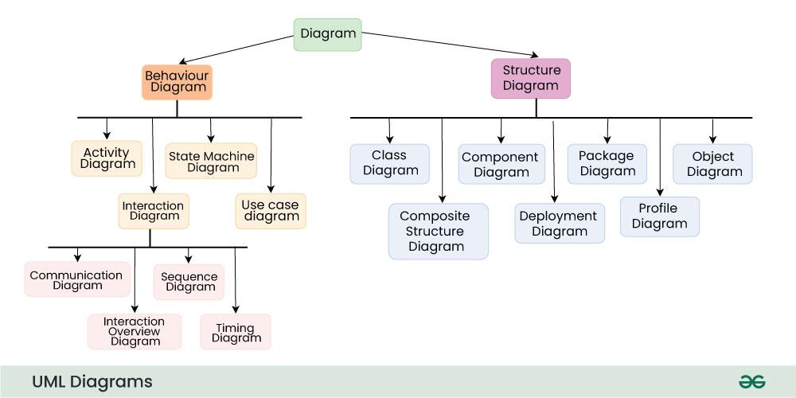

# Assignment 4 
**Name: Jesus Mendoza**

**Date: 08 Dec 2024**

**Class: 2143 OOP**

# Object-Oriented Programming Concepts in C++

This document provides definitions and examples of key Object-Oriented Programming (OOP) concepts with C++ examples.

## Abstract Classes and Interfaces
**Definition**: Abstract classes serve as blueprints for derived classes. They cannot be instantiated. They may include pure virtual functions (`= 0`) that derived classes must override.

```cpp
class Shape {
public:
    virtual void draw() = 0; // Pure virtual function
};

class Circle : public Shape {
public:
    void draw() override {
        std::cout << "Drawing Circle\n";
    }
};
```
## Abstraction
**Definition**: The process of hiding implementation details and showing only essential features of an object.

```cpp
class Vehicle {
public:
    virtual void move() = 0; // Abstract method
};

class Car : public Vehicle {
public:
    void move() override {
        cout << "Car is moving\n";
    }
};
```
## Access Modifiers (Public, Private, Protected)

**Defnition**: 
- Public: Accessible from anywhere.
- Private: Accessible only within the class.
- Protected: Accessible within the class and derived classes.

```cpp
class Example {
private:
    int privateVar;
protected:
    int protectedVar;
public:
    int publicVar;

    void setValues(int p, int pr, int pub) {
        privateVar = p;
        protectedVar = pr;
        publicVar = pub;
    }
};
```

## Attributes / Properties

**Definition**: Variables that belong to a class, used to hold data.

```cpp
class Person {
public:
    string name;
    int age;
};
```

## Class Variable

**Definition**: A variable that is shared across all instances of a class (often static in C++).

```cpp
class Counter {
public:
    static int count;
    Counter() { count++; }
};

int Counter::count = 0;
```

## Classes and Objects

**Definition**: 
- Class: A blueprint for creating objects
- Object: An instance of a class

```cpp
class Dog {
public:
    string name;
    void bark() {
        cout << name << " says Woof!\n";
    }
};

int main() {
    Dog d;
    d.name = "Buddy";
    d.bark();
}
```

## Collections and Iterators
**Definition**: Collections are containers for storing objects, and iterators are used to traverse these containers.

```cpp
#include <vector>
#include <iostream>
using namespace std;

int main() {
    vector<int> nums = {1, 2, 3, 4};
    for (auto it = nums.begin(); it != nums.end(); ++it) {
        cout << *it << " ";
    }
    return 0;
}
```

## Composition
**Definition**: A design principle where objects are composed of other objects.

```cpp
class Engine {
public:
    void start() {
        cout << "Engine started\n";
    }
};

class Car {
private:
    Engine engine;
public:
    void start() {
        engine.start();
    }
};

int main() {
    Car car;
    car.start();
}
```

## Constructors and Destructors

**Definition**: 
- Constructor: A special method called when an object is created.
- Destructor: A special method called when an object is destroyed.

```cpp
class Test {
public:
    Test() { cout << "Constructor called\n"; }
    ~Test() { cout << "Destructor called\n"; }
};

int main() {
    Test t;
}
```

## Design Patterns
**Definition**: A reusable solution to common software design problems.
### Singleton Example
```cpp
class Singleton {
private:
    static Singleton* instance;
    Singleton() {}

public:
    static Singleton* getInstance() {
        if (!instance) {
            instance = new Singleton();
        }
        return instance;
    }
};

Singleton* Singleton::instance = nullptr;
```
## Encapsulation
**Definition**: Restricting access to some of the object's components.

```cpp
class Account {
private:
    int balance;
public:
    void deposit(int amount) {
        balance += amount;
    }
    int getBalance() const {
        return balance;
    }
};
```

## Exception Handling

**Definition**: Mechanism to handle runtime errors gracefully.

```cpp
try {
    throw runtime_error("Error occurred");
} catch (const runtime_error& e) {
    cout << e.what() << endl;
}
```

## File I/O in OOP
**Definition**: File handling to read/write files in an object-oriented manner.
```cpp
#include <fstream>
#include <iostream>
using namespace std;

int main() {
    ofstream file("example.txt");
    file << "Hello, File!";
    file.close();

    ifstream infile("example.txt");
    string content;
    infile >> content;
    cout << content;
}
```

## Friends
**Definition**: `friend` keyword allows a class or function to access private members of another class.

```cpp
class B;

class A {
private:
    int secret;
public:
    A(int val) : secret(val) {}
    friend void showSecret(const A& a, const B& b);
};

class B {
private:
    int secret;
public:
    B(int val) : secret(val) {}
    friend void showSecret(const A& a, const B& b);
};

void showSecret(const A& a, const B& b) {
    cout << "A's secret: " << a.secret << ", B's secret: " << b.secret << endl;
}

int main() {
    A a(42);
    B b(99);
    showSecret(a, b);
}
```

## Generics and Templates
**Definition**: Templates allow defining functions or classes that work with any data type.
```cpp
template <typename T>
class Box {
private:
    T value;
public:
    Box(T val) : value(val) {}
    T getValue() { return value; }
};

int main() {
    Box<int> intBox(42);
    Box<string> strBox("Hello");
    cout << intBox.getValue() << " " << strBox.getValue() << endl;
}
```

## Inheritance
**Definition**: The mechanism by which one class (child) inherits properties and behaviors from another class (parent).
```cpp
class Animal {
public:
    void eat() {
        cout << "This animal eats food.\n";
    }
};

class Dog : public Animal {
public:
    void bark() {
        cout << "The dog barks.\n";
    }
};

int main() {
    Dog d;
    d.eat();
    d.bark();
}
```

## Instance Variable
**Definition**: A variable that is specific to an instance of a class and holds data unique to that instance.

```cpp
class Person {
public:
    string name;
    int age;
};

int main() {
    Person p1;
    p1.name = "Alice";
    p1.age = 25;

    Person p2;
    p2.name = "Bob";
    p2.age = 30;

    cout << p1.name << " is " << p1.age << " years old.\n";
    cout << p2.name << " is " << p2.age << " years old.\n";
}
```

## Member Variable
**Definition**: A variable defined within a class and belongs to every instance of that class.
```cpp
class Circle {
public:
    double radius;
};
```
## Memory Management (Garbage Collection, Pointers)
**Definition**: 
- Garbage Collection: Automatic memory management (not directly available in C++).
- Pointers: Variables that store memory addresses.

```cpp
int main() {
    int* ptr = new int(42); // Dynamically allocate memory
    cout << *ptr << endl;
    delete ptr; // Free allocated memory
}
```
## Method Overloading
**Definition**: Defining multiple functions with the same name but different parameters.
```cpp
class Print {
public:
    void display(int num) {
        cout << "Number: " << num << endl;
    }
    void display(string text) {
        cout << "Text: " << text << endl;
    }
};

int main() {
    Print p;
    p.display(10);
    p.display("Hello");
}
```
## Method
**Definition**: A function defined within a class.

```cpp
class Calculator {
public:
    int add(int a, int b) {
        return a + b;
    }
};

int main() {
    Calculator calc;
    cout << calc.add(5, 10) << endl;
}
```
## Multiple Inheritance
**Definition**: When a class inherits from more than one class.
```cpp
class A {
public:
    void showA() {
        cout << "This is class A\n";
    }
};

class B {
public:
    void showB() {
        cout << "This is class B\n";
    }
};

class C : public A, public B {};

int main() {
    C obj;
    obj.showA();
    obj.showB();
}
```

## Multithreading in OOP
**Definition**: The ability to run multiple threads concurrently for improved performance.
```cpp
#include <thread>
#include <iostream>
using namespace std;

void task1() {
    cout << "Task 1\n";
}

void task2() {
    cout << "Task 2\n";
}

int main() {
    thread t1(task1);
    thread t2(task2);

    t1.join();
    t2.join();
    return 0;
}
```

## Object Relationships (Association, Aggregation, Composition)
**Defnition**: 
- Association: A "uses-a" relationship where objects interact without ownership.
- Aggregation: A "has-a" relationship where one object owns another but can exist independently.
- Composition: A stronger "has-a" relationship where the owned object cannot exist independently.

```cpp
class Engine {
public:
    void start() {
        cout << "Engine started\n";
    }
};

class Car {
private:
    Engine engine; // Composition
public:
    void drive() {
        engine.start();
        cout << "Car is driving\n";
    }
};

int main() {
    Car car;
    car.drive();
}
```

## Object-Oriented Design Principles
**Definition**: Principles such as SOLID, encapsulation, and modularity guide effective OOP design.

### Single Responsibility Principle
```cpp
class ReportGenerator {
public:
    void generateReport() {
        cout << "Generating report...\n";
    }
};
```
## Operator Overloading
**Definition**: The ability to redefine operators for user-defined types.
```cpp
class Complex {
private:
    double real, imag;
public:
    Complex(double r, double i) : real(r), imag(i) {}

    Complex operator+(const Complex& c) {
        return Complex(real + c.real, imag + c.imag);
    }

    void display() {
        cout << real << " + " << imag << "i\n";
    }
};

int main() {
    Complex c1(1.0, 2.0), c2(3.0, 4.0);
    Complex c3 = c1 + c2;
    c3.display();
}
```

## Polymorphism
**Definition**: The ability of different classes to be treated as instances of the same class through a common interface.
```cpp
class Animal {
public:
    virtual void makeSound() {
        cout << "Animal sound\n";
    }
};

class Dog : public Animal {
public:
    void makeSound() override {
        cout << "Bark\n";
    }
};

int main() {
    Animal* a = new Dog();
    a->makeSound();
    delete a;
}
```

## Public / Private / Protected
**Definition**: Access modifiers determine the visibility of class members.
```cpp
class Example {
private:
    int privateVar;
protected:
    int protectedVar;
public:
    int publicVar;

    void setPrivate(int value) {
        privateVar = value;
    }
};
```

## SOLID Principles
**Definition**:
A set of design principles for maintainable software:

- S: Single Responsibility Principle
- O: Open/Closed Principle
- L: Liskov Substitution Principle
- I: Interface Segregation Principle
- D: Dependency Inversion Principle

## Static (Methods and Variables)
**Definition**: Static members belong to the class rather than any object.
```cpp
class Math {
public:
    static int square(int n) {
        return n * n;
    }
};

int main() {
    cout << Math::square(5) << endl;
}
```
## Testing in OOP (Unit Testing, Test-Driven Development)
**Definition**: Testing individual units of code (methods/classes) to ensure correctness.
```cpp
#include <cassert>

int add(int a, int b) {
    return a + b;
}

int main() {
    assert(add(2, 3) == 5);
    cout << "All tests passed!\n";
}
```

## UML Diagrams and Modeling
**Definition**: Unified Modeling Language (UML) is a visual way to design and represent object-oriented systems, such as class diagrams.



<sub>image source: https://www.geeksforgeeks.org/unified-modeling-language-uml-introduction/</sub>

## Virtual
**Definition**: A keyword in C++ that enables runtime polymorphism by allowing overriding in derived classes.
```cpp
class Base {
public:
    virtual void show() {
        cout << "Base class\n";
    }
};

class Derived : public Base {
public:
    void show() override {
        cout << "Derived class\n";
    }
};

int main() {
    Base* obj = new Derived();
    obj->show(); // Output: "Derived class"
    delete obj;
}
```

